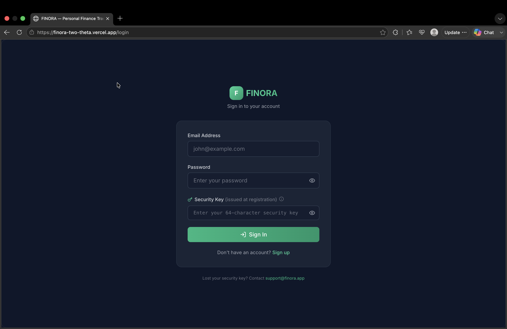
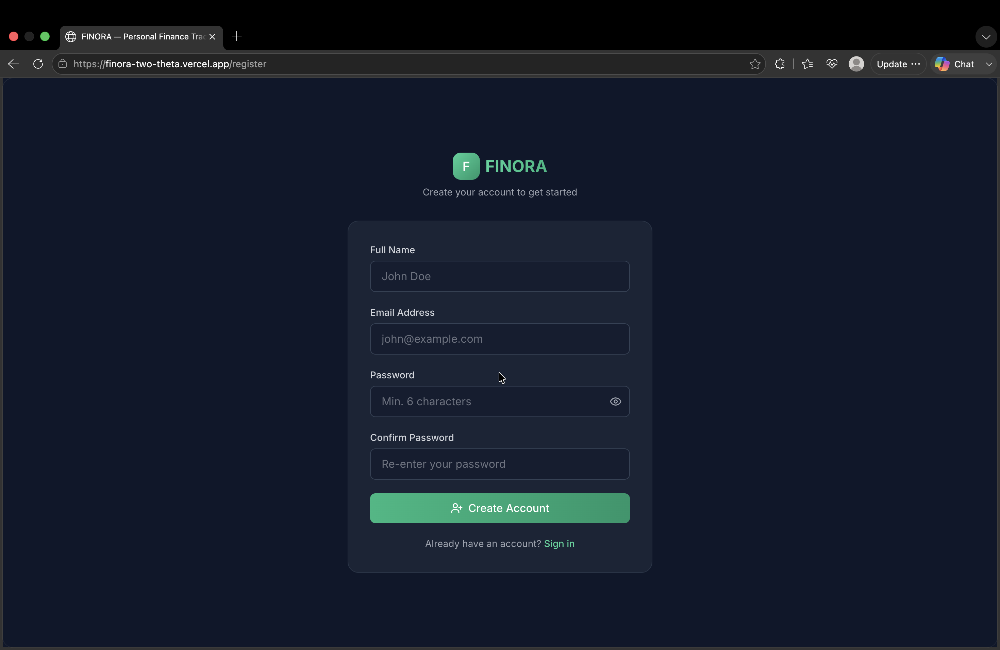
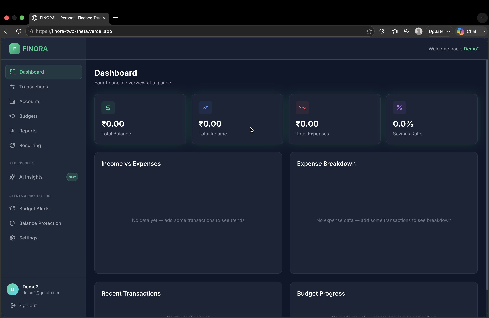
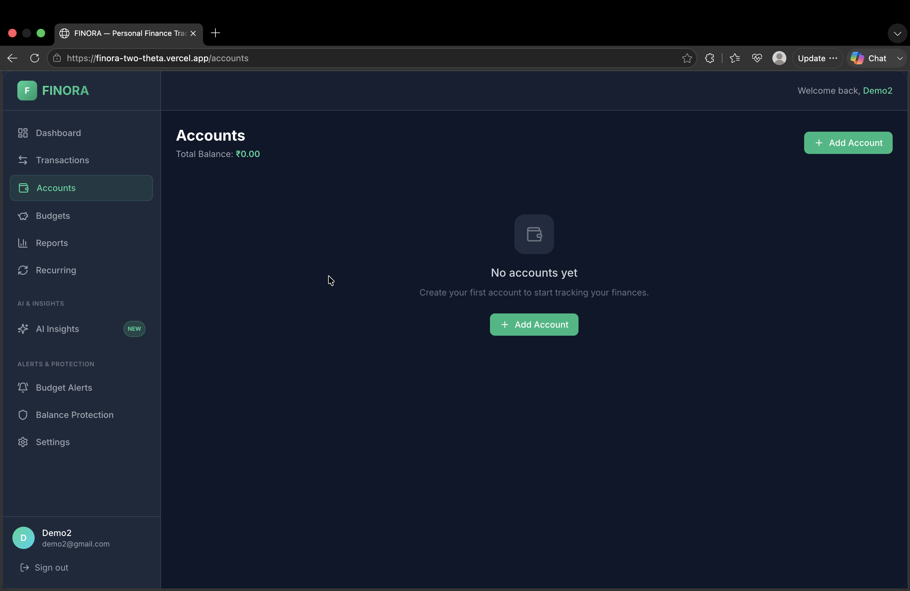
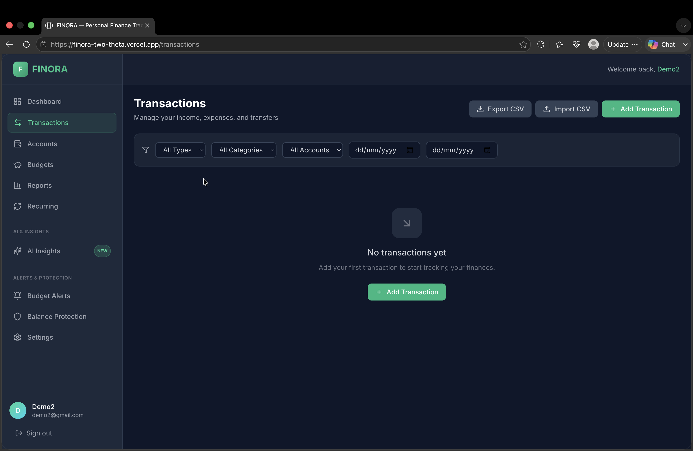
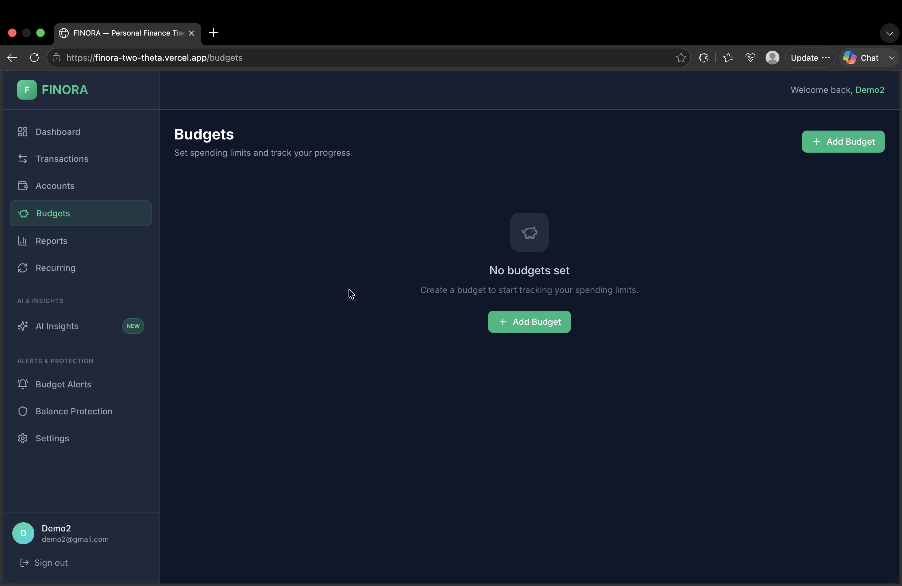
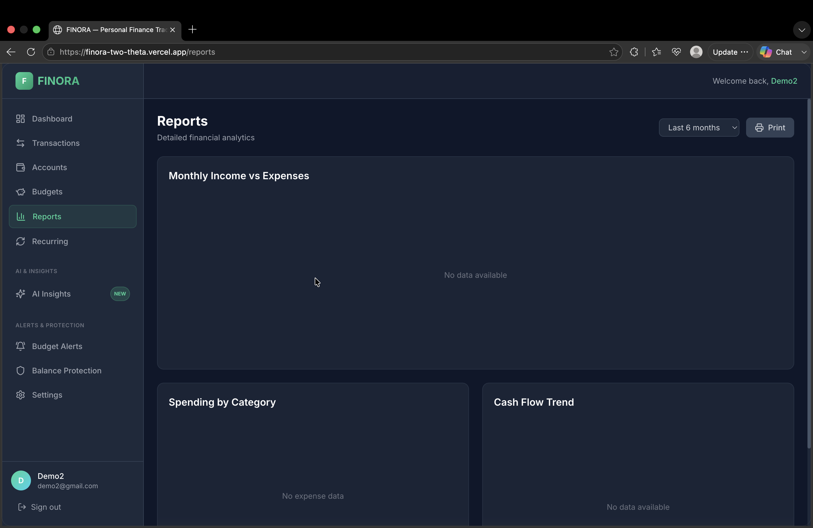
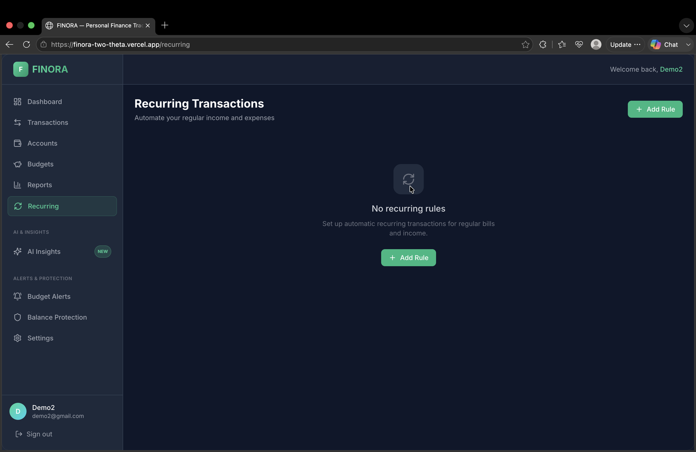

# 💰 FINORA — Personal Finance Tracker

[](https://finora-two-theta.vercel.app)
[](https://github.com/GoodBoy20/Finora)

A full-stack **MERN** personal finance management application that helps users securely manage their finances with **JWT authentication**, **2FA Security Key**, **budget tracking**, **recurring transactions**, **reports**, **automation rules**, and **AI-powered financial insights**.

## 🌐 Live Demo

**https://finora-two-theta.vercel.app**

---

# ✨ Features

- 🔐 JWT Authentication + 2FA Security Key
- 📊 Interactive Dashboard with financial overview
- 💸 Transaction Management (CRUD)
- 🏦 Multiple Account Management
- 📈 Budget Planning & Overspending Alerts
- 📉 Reports with Pie, Bar & Line Charts
- 🔁 Recurring Transactions
- ⚙️ Automation Rules (IF-THEN)
- 🤖 AI Financial Insights
- 📤 CSV Import & Export
- 👤 Profile & Settings Management

---

# 📸 Screenshots

### 🔐 Login



### 📝 Register



### 🏠 Dashboard



### 💳 Accounts



### 💸 Transactions



### 📊 Budgets



### 📈 Reports



### 🔁 Recurring Transactions



### 🤖 AI Insights


---

# 🛠 Tech Stack

### Frontend

- React (Vite)
- Tailwind CSS
- React Router v6
- Recharts
- Axios

### Backend

- Node.js
- Express.js
- REST API

### Database

- MongoDB
- Mongoose

### Authentication & Security

- JWT
- bcryptjs
- crypto

### Testing

- Jest
- Supertest
- mongodb-memory-server

---

# 🚀 Installation

## Prerequisites

- Node.js 18+
- MongoDB

## Clone Repository

```bash
git clone https://github.com/GoodBoy20/Finora.git

cd Finora
```

## Install Dependencies

### Backend

```bash
cd server
npm install
```

### Frontend

```bash
cd ../client
npm install
```

---

# ⚙️ Environment Variables

Create a **server/.env** file.

```env
PORT=5000
MONGO_URI=mongodb://localhost:27017/finora
JWT_SECRET=your_secure_jwt_secret_here
CLIENT_URL=http://localhost:5173
```

---

# ▶️ Run the Application

Start MongoDB

```bash
mongod
```

Backend

```bash
cd server
npm run dev
```

Frontend

```bash
cd client
npm run dev
```

---

# 🧪 Running Tests

Install test dependencies

```bash
cd server
npm install
```

Run all tests

```bash
npm test
```

Run coverage

```bash
npm run test:coverage
```

Run individual test files

```bash
npx jest tests/auth.test.js
npx jest tests/transactions.test.js
npx jest tests/accounts.test.js
npx jest tests/budgets.test.js
npx jest tests/balanceProtection.test.js
npx jest tests/csvImport.test.js
npx jest tests/csvExport.test.js
```

Run a specific test

```bash
npx jest --testNamePattern="should block transaction"
```

---

# 📊 Test Coverage Goals

| Module | Target |
|---------|:------:|
| Authentication | >90% |
| Transactions | >85% |
| Accounts | >80% |
| Balance Protection | >85% |
| Import/Export | >80% |

> **Note:** The first test run downloads the MongoDB binary (~509 MB). Future test runs reuse the cached binary.

---

# 🔒 Security

- Passwords are hashed using **bcryptjs (12 rounds)**.
- Security Keys are hashed before storage.
- JWT tokens expire after **7 days**.
- Protected API routes require valid authentication.
- Login responses never reveal whether the email or password is incorrect.

---

# 📂 Project Structure

```
Finora
├── client
├── server
├── screenshots
└── README.md
```

---

# 👨‍💻 Author

**Lokesh Prajapat**

GitHub: https://github.com/GoodBoy20

---
